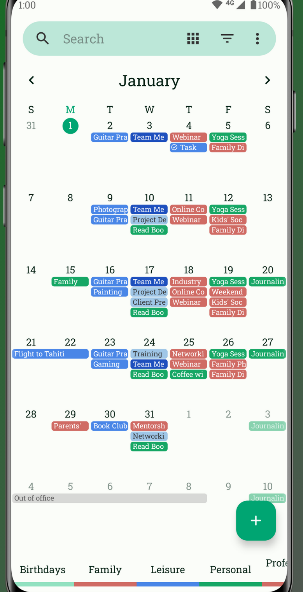
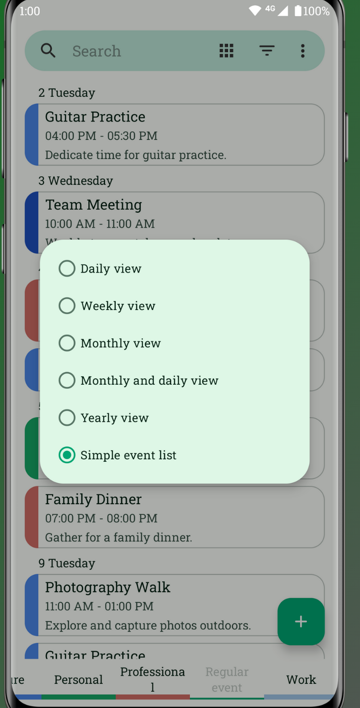
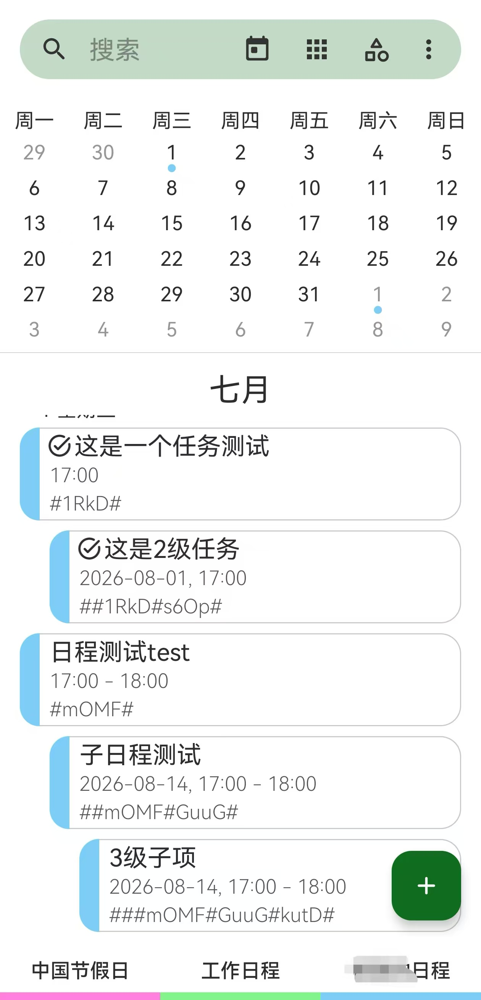
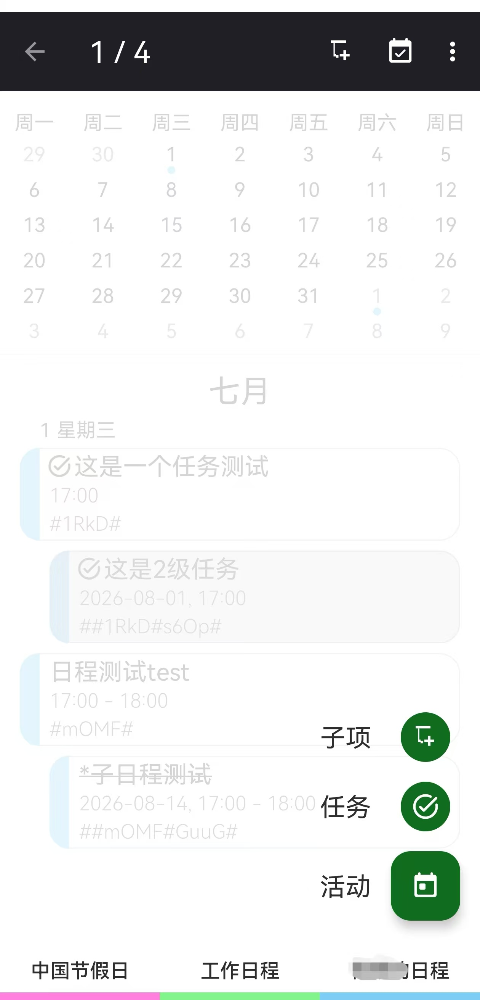

# CalendarTask 功能介绍 / Project Introduction

**日程任务 (CalendarTask)** 是一款基于开源 [Fossify Calendar](https://github.com/FossifyOrg/Calendar/) 项目深度定制与研发的日程管理应用。由 **Antigravity** AI 完成开发与功能增强，旨在提供最高效、最灵活的任务管理体验。

**CalendarTask** is a schedule management application based on the open-source [Fossify Calendar](https://github.com/FossifyOrg/Calendar/) project, extensively customized and enhanced by **Antigravity**. It is designed to provide the most efficient and flexible task management experience.

---

## 核心功能 / Core Features

### 1. 任务状态快速切换 / Quick Status Toggling
*   **中文**：在日历或任务列表视图中，只需**双击**任意日程，即可立刻切换其完成状态。完成的项目将自动添加前缀并以删除线显示。
*   **English**: Simply **double-click** any event or task in the calendar or list view to toggle its completion status instantly. Completed items are automatically prefixed and visually distinguished with a strikethrough.

### 2. 创新型多级日程体系 / Innovative Multi-level Schedules
*   **中文**：通过在描述字段添加 `#tag#` 格式的标签，您可以轻松构建复杂的层级任务树。
    *   **灵活层级**：起始处的 `#` 数量决定层级深度（L1 为 `#tag#`，L2 为 `##tag#`）。
    *   **智能关联**：标签内容用于精准匹配上级日程，支持跨时间的父子关系绑定。
    *   **可视化呈现**：提供直观的缩进显示，清晰展现任务之间的从属关系。
*   **English**: Build complex hierarchical task trees effortlessly by adding `#tag#` style tags in the description field.
    *   **Flexible Levels**: The number of leading `#` characters determines the depth (e.g., `#tag#` for L1, `##tag#` for L2).
    *   **Smart Linking**: Tag content is used to precisely match and link to parent schedules, enabling temporal-independent parent-child relationships.
    *   **Visual Clarity**: Offers intuitive indentation display to clearly visualize dependencies between tasks.

### 3. 智能递归逻辑 / Smart Recursive Logic
*   **中文**：支持父子任务的逻辑联动。当某个层级的所有子任务完成时，系统可自动提示或标记父任务已完成；同样，父任务的完成也可递归应用到其所有子项。
*   **English**: Supports logical linkage between parent and child tasks. When all sub-tasks of a level are finished, the system can automatically mark the parent as completed; similarly, completing a parent can recursively apply to all its sub-items.

### 4. 便捷的子项管理 / Effortless Sub-item Management
*   **中文**：支持在长按或编辑菜单中直接“添加子项”，系统会自动为您生成层级标签，大幅提升复杂任务的录入效率。
*   **English**: Support for "Add Sub-item" directly from the long-press or edit menu. The system automatically generates the required hierarchy tags, significantly improving the efficiency of entering complex tasks.

---

## 隐私与纯粹 / Privacy & Simplicity
*   **中文**：
    *   **无广告、无跟踪**：完全尊重用户隐私，不包含任何第三方跟踪器。
    *   **本地存储与同步**：所有数据默认存储在本地，并支持通过 CalDAV（如 Google Calendar, Nextcloud, DAVx5）进行双向同步。
    *   **开源基因**：继承 Fossify 的优秀架构，代码透明，可靠性高。
*   **English**:
    *   **No Ads, No Trackers**: Fully respects user privacy with zero third-party trackers.
    *   **Local Storage & Sync**: All data is stored locally by default, with support for two-way synchronization via CalDAV (e.g., Google Calendar, Nextcloud, DAVx5).
    *   **Open Source DNA**: Inherits the robust architecture of Fossify, ensuring transparency and reliability.

---

## 联系与支持 / Contact & Support
*   **Email**: joysky7777@gmail.com
*   **WeChat**: gohorizon
*   **Donation / 捐赠支持**: [PayPal.me/joysky77](https://paypal.me/joysky77)

---
*Created and Enhanced by Antigravity AI*
